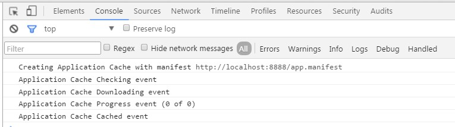
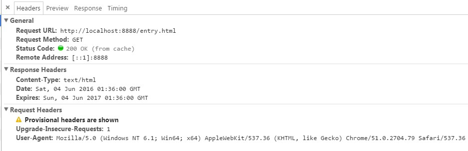
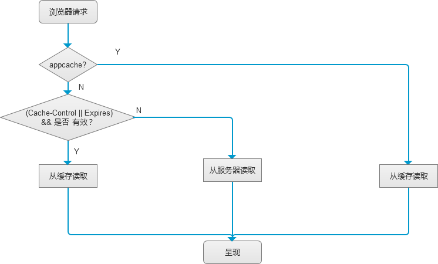

## 浏览器缓存总流程图


总的来说，客户端缓存分三类：

- 不发任何请求，直接从缓存中取数据，代表的特性有： Expires ，Cache-Control=<number>和appcache
- 发请求确认是否新鲜，再决定是否从缓存中取数据 :代表的特性有：Last-Modified/If-Modified-Since，Etag/If-None-Match
- 没有缓存，代表的特性有：Cache-Control：max-age=0/no-cache


## 一步一步说缓存

### 朴素的静态服务器
浏览的缓存的依据是server http response header , 为了实现对http response 的完全控制，本文用nodejs实现了一个简单的static 服务器，得益于nodejs简单高效的api,
不到60行就把一个可用的版本实现了：[源码](https://github.com/etoah/BrowserCachePolicy/step1)

浏览器里输入：http://localhost:8888/index.html

查看response header,返回正常，也没有用任何缓存。。服务器每次都要调用fs.readFile方法去读取硬盘上的文件的。当服务器的请求量一上涨，硬盘IO会吃不消的。 


```
response header:
HTTP/1.1 200 OK
Content-Type: text/html
Date: Fri, 03 Jun 2016 14:15:35 GMT
Connection: keep-alive
Transfer-Encoding: chunked
```


###  设置超时时间


对于指定后缀文件和过期日期，为了保证可配置。建立一个config.js。

```javascript
exports.Expires = {

    fileMatch: /^(gif|png|jpg|js|css|html)$/ig,

    maxAge: 60*60*24*365

};
```
为了把缓存这个职责独立出来,我们再新建一个cache.js,作为一个中间件处理request.

加上超期时间,代码如下

```javascript

module.exports = function (request, response) {
     var pathname = url.parse(request.url).pathname;
    var ext = path.extname(pathname);
    ext = ext ? ext.slice(1) : 'unknown';

    if (ext.match(config.Expires.fileMatch)) {

        var expires = new Date();

        expires.setTime(expires.getTime() + config.Expires.maxAge * 1000);

        response.setHeader("Expires", expires.toUTCString());
        
        response.setHeader("Cache-Control", "max-age=" + config.Expires.maxAge);

    }
}

```
这时我们刷新页面可以看到response header 变为这样了：
```
HTTP/1.1 200 OK
Expires: Sat, 03 Jun 2017 15:07:23 GMT
Cache-Control: max-age=31536000
Content-Type: text/html
Date: Fri, 03 Jun 2016 15:07:23 GMT
Connection: keep-alive
Transfer-Encoding: chunked
```
多了expires，但这是第一次访问，流程和上面一样，还是需要从硬盘读文件，再response

再刷新页面，可以看到http header ：

```
Request URL:http://127.0.0.1:8888/index.html
Request Method:GET
Status Code:200 OK (from cache)
Remote Address:127.0.0.1:8888
```


但是到这里遇到一个问题，并没有达到预期的效果，

缓存并没有生效。

```
GET /index.html HTTP/1.1
Host: 127.0.0.1:8888
Connection: keep-alive
Cache-Control: max-age=0
Accept: text/html,application/xhtml+xml,application/xml;q=0.9,image/webp,*/*;q=0.8
Upgrade-Insecure-Requests: 1
User-Agent: Mozilla/5.0 (Windows NT 10.0; WOW64) AppleWebKit/537.36 (KHTML, like Gecko) Chrome/50.0.2661.102 Safari/537.36
Accept-Encoding: gzip, deflate, sdch
Accept-Language: zh-CN,zh;q=0.8
```

查看request header 发现 Cache-Control: max-age=0


查看文档发现：
>Chrome does something quite different: ‘Cache-Control’ is always set to ‘max-age=0′, no matter if you press enter, f5 or ctrl+f5. Except if you start Chrome and enter the url and press enter.

所以做了一个entry,通过链接跳转的方式进入就可以看到cache的效果了。

其它的浏览器特性可以查看文末的【迷之浏览器】

浏览器在发送请求之前由于检测到Cache-Control和Expires（Cache-Control的优先级高于Expires，但有的浏览器不支持Cache-Control，这时采用Expires），
如果没有过期，则不会发送请求，而直接从缓存中读取文件。 

Cache-Control与Expires的作用一致，都是指明当前资源的有效期，控制浏览器是否直接从浏览器缓存取数据还是重新发请求到服务器取数据。
只不过Cache-Control的选择更多，设置更细致，如果同时设置的话，其优先级高于Expires。


### html5 Application Cache

除了Expires 和Cache-Control 两个特性的缓存可以让browser完全不发请求的话，别忘了还有一个html5的新特性 `Application Cache`,
在我的另一篇文章中有简单的介绍[HTML5 Application cache初探和企业应用启示](http://www.cnblogs.com/etoah/p/4931903.html).

为了消除 expires cache-control 的影响，先注释掉这两行，并消除浏览器的缓存。
``` javascript
       // response.setHeader("Expires", expires.toUTCString());
        //response.setHeader("Cache-Control", "max-age=" + config.Expires.maxAge);
```
新增文件app.manifest,由于appcache 会缓存当前文件，我们可不指定缓存文件，只需输入`CACHE MANIFEST`，并在entry.html引用这个文件。
```html
<html lang="en" manifest="app.manifest">
```
在浏览器输入：http://localhost:8888/entry.html，可以看到appcache ,已经在缓存文件了：     


这时再刷新浏览器,可以看到即使没有 Expires 和Cache-Control 也是 from cache ,   



而index.html 由于没有加Expires ，Cache-Control和appcache 还是直接从服务器端取文件。

这时缓存的控制如下



本例子的源码为分支 step3

### Last-Modified/If-Modified-Since

Last-Modified/If-Modified-Since要配合Cache-Control使用。
-  Last-Modified：标示这个响应资源的最后修改时间。web服务器在响应请求时，告诉浏览器资源的最后修改时间。
-  If-Modified-Since：当资源过期时（使用Cache-Control标识的max-age），发现资源具有Last-Modified声明，则再次向web服务器请求时带上头 If-Modified-Since，表示请求时间。web服务器收到请求后发现有头If-Modified-Since 则与被请求资源的最后修改时间进行比对。若最后修改时间较新，说明资源又被改动过，则响应整片资源内容（写在响应消息包体内），HTTP 200；若最后修改时间较旧，说明资源无新修改，则响应HTTP 304 (无需包体，节省浏览)，告知浏览器继续使用所保存的cache。

所以我们需要把 Cache-Control 设置的尽可能的短,让资源过期:
```javascript

exports.Expires = {

    fileMatch: /^(gif|png|jpg|js|css|html)$/ig,

    maxAge: 1

};

```

同时需要识别出文件的最后修改时间,并返回给客户端,我们同时也要检测浏览器是否发送了If-Modified-Since请求头。如果发送而且跟文件的修改时间相同的话，我们返回304状态。 
代码如下：

```javascript
        fs.stat(realPath, function (err, stat) {
            var lastModified = stat.mtime.toUTCString();
            var ifModifiedSince = "If-Modified-Since".toLowerCase();
            response.setHeader("Last-Modified", lastModified);
            if (request.headers[ifModifiedSince] && lastModified == request.headers[ifModifiedSince]) {
                response.writeHead(304, "Not Modified");
                response.end();
            }
        })
```
如果没有发送或者跟磁盘上的文件修改时间不相符合，则发送回磁盘上的最新文件。 

同样我们清缓存,刷新两次就能看到效果如下:


服务器请求确认了文件是否新鲜,直接返回header, 网络负载特别的小:


这时我们的缓存控制流程图如下:


 


### Browser Magic【迷之浏览器】

So I tried this for different browsers. Unfortunately it’s specified nowhere what a browser has to send in which situation.

- Internet Explorer 6 and 7 do both send only cache refresh hints on ctrl+F5. On ctrl+F5 they both send the header field ‘Cache-Control’ set to ‘no-cache’.

- Firefox 3 do send the header field ‘Cache-Control’ with the value ‘max-age=0′ if the user press f5. If you press ctrl+f5 Firefox sends the ‘Cache-Control’ with ‘no-cache’ (hey it do the same as IE!) and send also a field ‘Pragma’ which is also set to ‘no-cache’.

- Firefox 2 does send the header field ‘Cache-Control’ with the value ‘max-age=0′ if the user press f5. ctrl+f5 does not work.

- Opera/9.62 does send ‘Cache-Control’ with the value ‘max-age=0′ after f5 and ctrl+f5 does not work.

- Safari 3.1.2 behaves like Opera above.

- Chrome does something quite different: ‘Cache-Control’ is always set to ‘max-age=0′, no matter if you press enter, f5 or ctrl+f5. Except if you start Chrome and enter the url and press enter.


